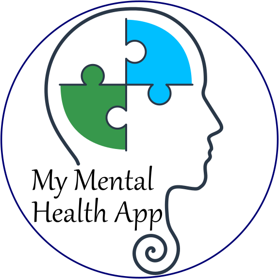

**CS 4471 December 2nd, 2022**

### Group 9 Presents:

# My Mental Health App

### Project Details:

**My Mental Health App** is an android app, made to help users between therapy sessions.

## Project build details:

1. clone the project:
   1. git clone https://github.com/Jon-AL/4471---Therapy-Support-App.git
2. Please build the project inside IntelliJ Community Edition (CE).
3. Please add the android SDK. You will need to install Gradle and an emulator device.
   1. A recommended emulator is Pixel 5 API 30.
4. The project runs on openJDK11, SDK 32, gradle 7.2.1, and android 11.
5. Once everything is installed, you can build on the recommended emulator or your choice and then run the application.
6. We **Highly** recommend installing Android Studio, it is free (through your uwo email account), and will be far easier to use. Link:
    1. https://developer.android.com/studio
    
###### Build References:

1. https://www.jetbrains.com/help/idea/create-your-first-android-application.html#build-run-Android-application
2. https://www.jetbrains.com/help/idea/gradle.html
3. https://developer.android.com/studio
